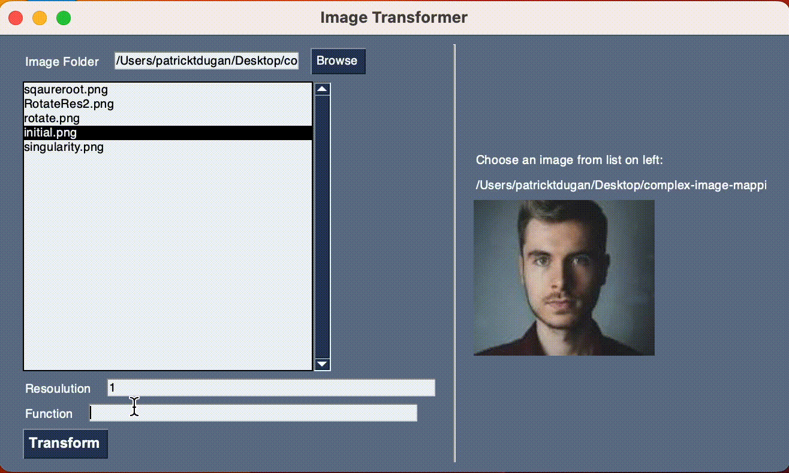
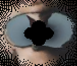

# complex-image-mapping


# how to run
First install PySimpleGUI

```
pip install PySimpleGUI
```

Then run map.py


From there you can select an image (png only) and input a complex function (using z as your variable)

# how it works

The program modifies images by interpreting their pixel's cooridinates as complex numbers
(x,y) = x + yi

and then passes these cordinates throguh a given complex function, moving the pixel to the output

this provides and intresting way of seeing how these functions behave by looking at how they distort common images

# intresting examples


| Rotation $f(z) = z\frac{1 + i}{\sqrt{2}}$ | Singularity $f(z) = \frac{1}{10z}$ | 
| ------------- | ----------- |
|  |  |
